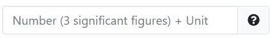

# `pl-units-input` element

Fill in the blank field
that allows for **numeric** input and **units**.

## Sample element



### question.html

```html
<pl-units-input answers-name="length" comparison="sigfig" digits=3>
</pl-units-input>
```

### server.py

```py
def generate(data):
    data['correct_answers']['length2'] = "1 m"
```

## Customizations

| Attribute        | Type     | Default    | Description   |
| ---------        | -------- | ---------- | ------------- |
| `answers-name`   | string   | &mdash;    | Variable name to store data in. |
| `weight`         | integer  | 1          | Weight to use when computing a weighted average score over elements. |
| `correct-answer` | string   | special    | Correct answer for grading. Defaults to `data["correct_answers"][answers-name]`. |
| `label`   | text | &mdash; | A prefix to display before the input box (e.g., `label="$F =$"`). |
| `suffix`  | text | &mdash; | A suffix to display after the input box (e.g., `suffix="$\rm m/s^2$"`). |
| `display` | "block" or "inline" | "inline" | How to display the input field. |
| `comparison` | "exact", "sigfig", or "relabs" | "sigfig" | How to grade. "relabs" uses relative ("rtol") and absolute ("atol") tolerances. "sigfig" use "digits" significant digits. "exact" uses `==` and should only be used for integers. |
| `rtol`       | number  | 1e-2 | Relative tolerance for `comparison="relabs"`. |
| `atol`       | number  | 1e-8 | Absolute tolerance for `comparison="relabs"`. |
| `digits`     | integer |    2 | Number of digits that must be correct for `comparison="sigfig"`. |
| `allow-blank`      | boolean | false | Whether or not an empty input box is allowed. By default, empty input boxes will not be graded (invalid format). |
| `allow-numberless` | boolean | false | Whether or not an input with only a unit is allowed. |
| `allow-unitless`   | boolean | false | Whether or not an input with only a number is allowed. |
| `blank-value`      | string  | ""    | Value to be used as an answer if element is left blank. Only applied if `allow-blank` is true. Must follow the same format as an expected user input. |
| `numberless-value` | number  | 0     | Value to be prepended to answer if input has no number. Only applied if `allow-numberless` is true. |
| `unitless-value`   | string  | "rad" | Value to be appended to answer if input has no unit. Only applied if `allow-unitless` is true. |
| `size`           | integer | 35   | Size of the input box. |
| `show-help-text` | boolean | true | Show the question mark at the end of the input displaying required input parameters. |

## Example implementations

- [questions/UnitMadness](/questions/UnitMadness)
